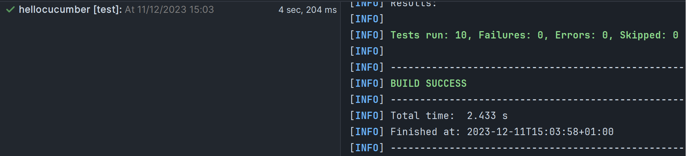
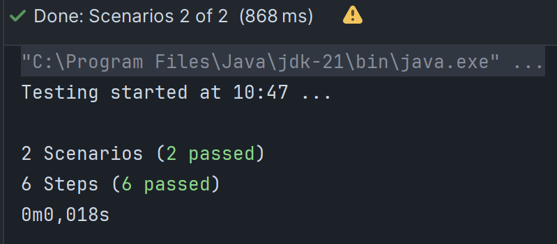

= R5.A.08 -- Dépôt pour les TPs
:icons: font
:MoSCoW: https://fr.wikipedia.org/wiki/M%C3%A9thode_MoSCoW[MoSCoW]

Ce dépôt concerne les rendus de mailto:hugo.castell@etu.univ-tlse2.fr[Hugo CASTELL].

== TP1

.Feature Friday
[source,cucumber]
---
Feature: Friday is TGIF
  Scenario Outline: Answers depending on the day of the week
    Given today is "<day>"
    When I ask whether it's Friday yet
    Then I should be told "<answer>"
    Examples:
      | day            | answer |
      | Sunday         | Nope   |
      | Saturday       | Nope   |
      | Friday         | TGIF   |
      | Thursday       | Nope   |
      | Wednesday      | Nope   |
      | Tuesday        | Nope   |
      | Monday         | Nope   |
      | Friday*        | TGIF   |
      | anything else! | Nope   |
---

.Preuve des tests concluents

== TP2

.Feature Friday
[source,java]
---
public class Order {
    private String owner;
    private String target;
    private final List<String> cocktails;

    public Order(String owner, String target, List<String> cocktails) {
        this.owner = owner;
        this.target = target;
        this.cocktails = cocktails;
    }

    public Order(String owner) {
        this(owner, null, new ArrayList<>());
    }

    public String getOwner() {
        return owner;
    }

    public void setOwner(String owner) {
        this.owner = owner;
    }

    public String getTarget() {
        return target;
    }

    public void setTarget(String target) {
        this.target = target;
        if(!(this.owner.equals("Romeo") && this.target.equals("Juliette"))) {
            this.addCocktails("You are not Romeo & Juliette");
        }
    }

    public List<String> getCocktails() {
        return this.cocktails;
    }

    public void addCocktails(String... cocktails) {
        Collections.addAll(this.cocktails, cocktails);
    }
}
---

.Preuve des tests concluents

