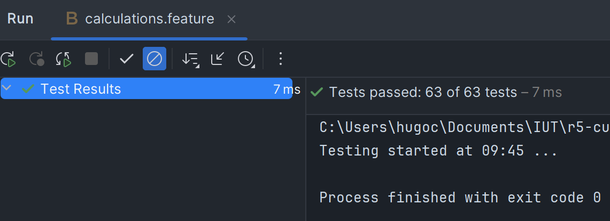

= R5.A.08 -- Dépôt pour les TPs
:icons: font
:MoSCoW: https://fr.wikipedia.org/wiki/M%C3%A9thode_MoSCoW[MoSCoW]

Ce dépôt concerne les rendus de mailto:hugo.castell@etu.univ-tlse2.fr[Hugo CASTELL].

== TP1

.Feature Friday
[source,cucumber]
----
Feature: Friday is TGIF
  Scenario Outline: Answers depending on the day of the week
    Given today is "<day>"
    When I ask whether it's Friday yet
    Then I should be told "<answer>"
    Examples:
      | day            | answer |
      | Sunday         | Nope   |
      | Saturday       | Nope   |
      | Friday         | TGIF   |
      | Thursday       | Nope   |
      | Wednesday      | Nope   |
      | Tuesday        | Nope   |
      | Monday         | Nope   |
      | Friday*        | TGIF   |
      | anything else! | Nope   |
----

.Preuve des tests concluents
image::tp1_tests.png[width=90%]

== TP2

.Feature Friday
[source,java]
----
public class Order {
    private String owner;
    private String target;
    private final List<String> cocktails;

    public Order(String owner, String target, List<String> cocktails) {
        this.owner = owner;
        this.target = target;
        this.cocktails = cocktails;
    }

    public Order(String owner) {
        this(owner, null, new ArrayList<>());
    }

    public String getOwner() {
        return owner;
    }

    public void setOwner(String owner) {
        this.owner = owner;
    }

    public String getTarget() {
        return target;
    }

    public void setTarget(String target) {
        this.target = target;
        if(!(this.owner.equals("Romeo") && this.target.equals("Juliette"))) {
            this.addCocktails("You are not Romeo & Juliette");
        }
    }

    public List<String> getCocktails() {
        return this.cocktails;
    }

    public void addCocktails(String... cocktails) {
        Collections.addAll(this.cocktails, cocktails);
    }
}
----

.Preuve des tests concluents
image::tp2_tests.png[width=100%]

== TP3

J'ai choisi de créer un petit projet python de géométrie.
J'y ai vérifié des calculs de distance de points et de périmètre.

.Contenu du fichier Gherkin
[source,gherkin]
----
Feature: Points distance calculations

  Scenario Outline: Calculate distance between two points
    Given I have a point on <x> and <y> coordinates
    And I have another point on <x2> and <y2> coordinates
    When I calculate the distance between them
    Then I should get <result> as result
    Examples:
      | x | y | x2 | y2 | result |
      | 0 | 0 | 0  | 0  | 0      |
      | 0 | 0 | 1  | 0  | 1      |
      | 0 | 0 | 0  | 1  | 1      |
      | 0 | 0 | 1  | 1  | 1.414  |
      | 1 | 1 | 1  | 1  | 0      |
      | 1 | 1 | 4  | 5  | 5      |
      | 1 | 1 | 3  | 3  | 2.828  |

  Scenario Outline: Perimeter from triangle made with between three points
    Given I have a point on <x> and <y> coordinates
    And I have another point on <x2> and <y2> coordinates
    And I have a third point on <x3> and <y3> coordinates
    When I calculate the perimeter of the triangle made with them
    Then I should get <result> as result
    Examples:
      | x | y | x2 | y2 | x3 | y3 | result |
      | 0 | 0 | 0  | 0  | 0  | 0  | 0      |
      | 0 | 0 | 1  | 0  | 1  | 0  | 2      |
      | 0 | 0 | 0  | 1  | 0  | 1  | 2      |
      | 0 | 0 | 1  | 1  | 1  | 1  | 2.828  |
      | 1 | 1 | 1  | 1  | 1  | 1  | 0      |
      | 1 | 1 | 4  | 5  | 4  | 5  | 10.0   |
      | 1 | 1 | 3  | 3  | 3  | 3  | 5.656  |
----

.Contenu des tests
[source,python]
----
from behave import *

from classes import Point

@given("I have a point on {x:n} and {y:n} coordinates")
def i_have_a_point_x_and_y_coordinates(context, x, y):
    context.point1 = Point(x, y)

@step("I have another point on {x2:g} and {y2:g} coordinates")
def i_have_another_point_on_x2_and_y2_coordinates(context, x2, y2):
    context.point2 = Point(x2, y2)

@step("I have a third point on {x3:g} and {y3:g} coordinates")
def i_have_another_point_on_x3_and_y3_coordinates(context, x3, y3):
    context.point3 = Point(x3, y3)

@when("I calculate the distance between them")
def i_calculate_the_distance_between_them(context):
    context.result = context.point1.distance(context.point2)

@when("I calculate the perimeter of the triangle made with them")
def i_calculate_the_perimeter_of_the_triangle_made_with_them(context):
    context.result = context.point1.distance(context.point2) + \
                     context.point2.distance(context.point3) + \
                     context.point3.distance(context.point1)

@then("I should get {result:g} as result")
def i_should_get_result_as_result(context, result):
    assert context.result == result

----

.Preuve des tests concluents

> Je ne sais pas pourquoi il écrit 63 tests sur PyCharm mais il les exécute tous... 

== TP4

Lien vers la [documentation minimale ici](./hellocucumber/report.txt)

Je n'ai pas réussi à faire la documentation avec cukedoctor à cause de problèmes d'imports de dépendances maven.
